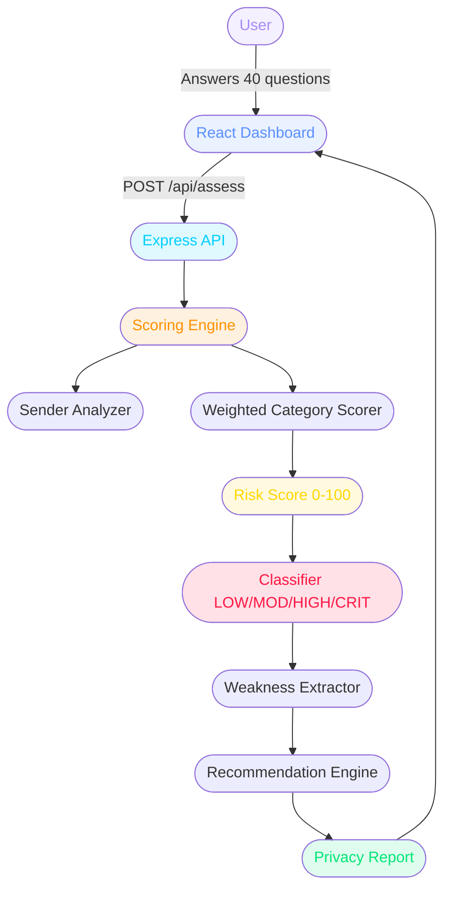

# Social Media Privacy Risk Assessment Framework


A privacy-risk assessment platform where users answer questions about their social media behavior and receive a personalized **Privacy Risk Score**, category-wise analysis, detected weaknesses, and actionable remediation steps.

🔒 **[Live Demo →](https://social-media-privacy-risk.vercel.app/)**
⭐ **[GitHub →](https://github.com/Neha-Joshi05/Social-Media-Privacy-Risk.git)**

> ⚠️ **Ethical Notice:** Purely defensive and educational. Uses only self-reported data and synthetic demo profiles. No real profiles are scraped, no accounts are accessed, no real individuals are identified or tracked.

---

## What is this project?

Social media oversharing is one of the leading causes of identity theft, doxxing, social engineering attacks, and impersonation. Most people have no idea how much they expose publicly.

This framework simulates what a **Privacy Analyst** or **GRC Analyst** does when auditing a user's social media exposure:

1. **Assess** behavior across 10 privacy categories
2. **Score** risk from 0–100 with weighted category analysis
3. **Classify** as LOW / MODERATE / HIGH / CRITICAL
4. **Explain** exactly which behaviors are risky and why
5. **Recommend** specific, actionable remediation steps
6. **Generate** a downloadable privacy report

---

## Risk Classification

| Score | Level | Meaning |
|-------|-------|---------|
| 0–20 | 🟢 LOW | Good privacy practices |
| 21–40 | 🟡 MODERATE | Some risks to address |
| 41–70 | 🟠 HIGH | Significant exposure detected |
| 71–100 | 🔴 CRITICAL | Severe privacy risk — act immediately |

---

## Assessment Categories (40 Questions)

| Category | Focus Area | Weight |
|----------|-----------|--------|
| A — Profile Visibility | Public profile, real name, search by phone/email | 12% |
| B — Personal Information | Phone, DOB, email, workplace exposure | 12% |
| C — Location Privacy | Real-time location, travel plans, EXIF metadata | 12% |
| D — Posts & Content | Post audience, old posts, consent for others' photos | 10% |
| E — Friends & Followers | Unknown connections, follower audits | 8% |
| F — Tagging & Mentions | Tag approval, auto-publish, mention controls | 8% |
| G — Authentication & Security | MFA, password reuse, login alerts | 14% |
| H — Third-Party Apps | Connected apps, social login, quiz apps | 8% |
| I — Messaging & Social Engineering | DM links, suspicious messages, credential sharing | 8% |
| J — Digital Footprint | Self-search, search engine indexing, old accounts | 8% |

---

## Architecture



---

## Project Structure

```
Social-Media-Privacy-Risk/
├── server/
│   ├── api/
│   │   ├── assess.js       # POST /api/assess — scoring endpoint
│   │   ├── questions.js    # GET /api/questions — question bank
│   │   ├── demo.js         # GET /api/demo — synthetic profiles
│   │   └── health.js       # GET /api/health — health check
│   ├── engine/
│   │   ├── questions.js    # 40-question bank, 10 categories
│   │   └── scorer.js       # Weighted risk scoring engine
│   ├── vercel.json         # Vercel serverless config
│   ├── index.js            # Express server (local dev)
│   └── package.json
├── client/
│   ├── src/
│   │   ├── components/
│   │   │   ├── RiskBadge.jsx      # Risk level badge
│   │   │   ├── ScoreGauge.jsx     # Circular score gauge
│   │   │   ├── CategoryBar.jsx    # Category score bar
│   │   │   ├── QuestionCard.jsx   # Question UI card
│   │   │   └── WeaknessCard.jsx   # Weakness indicator
│   │   ├── pages/
│   │   │   ├── AssessPage.jsx     # 40-question assessment flow
│   │   │   ├── ResultPage.jsx     # Results + radar + report
│   │   │   └── DemoPage.jsx       # Synthetic profile demos
│   │   ├── utils/
│   │   │   ├── api.js             # Axios API calls
│   │   │   └── helpers.js         # Color/risk utilities
│   │   ├── App.jsx                # Nav + routing
│   │   └── index.css              # Dark theme
│   ├── .env
│   └── package.json
└── README.md
```

---

## Local Setup

```bash
# Clone
git clone https://github.com/Neha-Joshi05/Social-Media-Privacy-Risk.git
cd Social-Media-Privacy-Risk

# Backend
cd server
npm install
node index.js
# → http://localhost:5001

# Frontend (new terminal)
cd client
npm install
npm run dev
# → http://localhost:5173
```

---

## API Endpoints

| Method | Endpoint | Description |
|--------|----------|-------------|
| GET | `/api/health` | Health check |
| GET | `/api/questions` | Get all 40 questions + categories |
| POST | `/api/assess` | Submit answers, get risk report |
| GET | `/api/demo` | Get synthetic demo profiles |

### POST `/api/assess` — Request:
```json
{
  "platform": "Instagram",
  "answers": {
    "A1": 0,
    "A2": 1,
    "G1": 0
  }
}
```

### Response:
```json
{
  "score": 78,
  "level": "CRITICAL",
  "categories": { "A": { "score": 90, "level": "CRITICAL" } },
  "weaknesses": [...],
  "recommendations": [...],
  "checklist": [...]
}
```

---

## Privacy Categories Explained

**Profile Visibility** — Is your profile public? Can strangers find you by phone or email?

**Personal Information** — Is your phone number, full DOB, or email visible publicly?

**Location Privacy** — Do you share real-time location or travel plans? Does your photo EXIF data leak your GPS?

**Posts & Content** — Are old posts public? Do you post others' photos without consent?

**Friends & Followers** — Do you accept unknown connections? Is your friend list public?

**Tagging & Mentions** — Can anyone tag you without approval? Do tags auto-publish?

**Authentication** — Do you use MFA? Do you reuse passwords? Are login alerts enabled?

**Third-Party Apps** — How many apps have access to your profile? Do you use social login?

**Messaging** — Do you click DM links from strangers? Have you shared OTPs or credentials via DM?

**Digital Footprint** — Have you searched for yourself? Are old accounts deactivated?

---

## Tech Stack

| Layer | Technology |
|-------|-----------|
| Backend | Node.js + Express |
| Frontend | React 18 + Vite |
| Charts | Recharts (Radar + Bar) |
| Animation | Framer Motion |
| Icons | Lucide React |
| HTTP | Axios |
| Deployment | Vercel |

---

## Author

**Neha Joshi** — Computer Engineering, AI & Data Science
NVIDIA DLI Certified · IIT Delhi Certified
[GitHub](https://github.com/Neha-Joshi05/Social-Media-Privacy-Risk.git) · [LinkedIn](https://www.linkedin.com/in/neha-joshi-0851a2322?utm_source=share_via&utm_content=profile&utm_medium=member_android)

---

*Social Media Privacy Risk Assessment · Node.js + React · Defensive cybersecurity · Built end-to-end*
